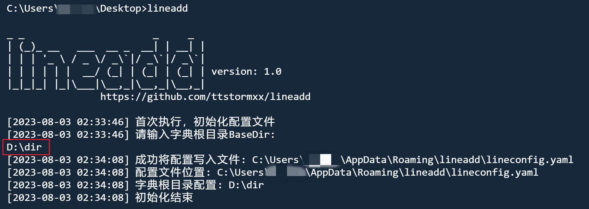
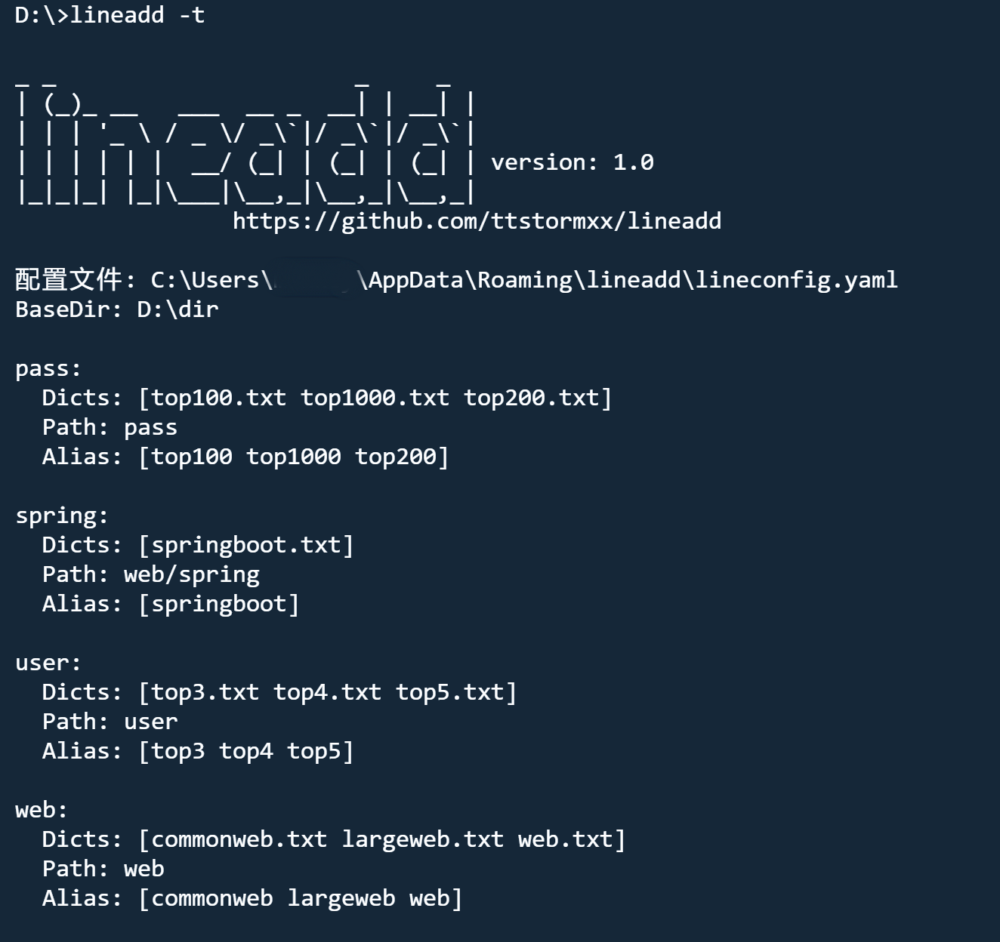
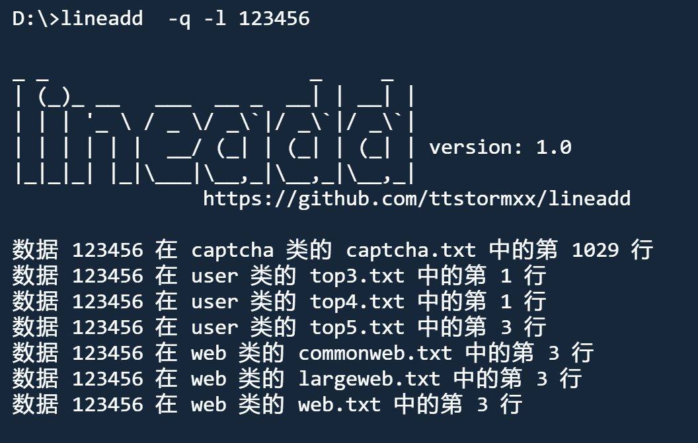

# lineadd
[ENGLISH_README](README_EN.md)
## 简介
在渗透测试工作中字典是灵魂所在，字典维护是一项繁琐但重要的工作。lineadd提供了一种简单有效的字典管理解决方案。人生苦短，使用lineadd让字典管理生活轻松一点。

## 功能
分类、添加、删除、统计、查看、查询、备份，字典维护过程中涉及到的活动均支持

## 编译
环境: go 1.20+

下载release中的二进制文件

或自行编译
```
go mod init lineadd.go
go mod tidy
go build lineadd.go
```
## 帮助信息
```
-a      add 加行模式
-d      delete 减行模式
-c      count 统计【全部】字典情况 行数 大小
-r      read 读取指定字典
-b      backup 备份全部字典
-t      status 字典状态 配置文件状态
-s      single 指定单一字典
-f      file 含有待处理数据的文件
-l      line 命令行输入的待处理行(逗号分隔)
-q      query 查询某行是否在字典中, 返回字典名和行数
-config 重新初始化(遍历字典根目录初始化配置文件)
-base   字典根目录(用于在-config时设置BaseDir)
-write  依据配置文件初始化字典根目录(-config时使用)
-silent 安静模式 一个挂件
```
## 快速使用
#### 初始化
首次运行需要输入字典根目录，程序自动遍历该目录初始化配置文件



#### 编辑配置文件 lineadd.yml
配置文件可以自定义，即使所有字典txt文件都在同一目录下，也可以自由分类


#### 向某类字典新增行
`echo 123123123|lineadd -a web`


#### 查看字典状态和别名
`lineadd -t`


## trick
#### 数据输入模式
支持文件读取、cmd输入、管道符输入、标准输入4种模式


当文件读取、cmd输入、管道符输入均不存在时，启用标准输入


#### 自定义字典分类
配置文件中字典分类结构只要满足下面的结构即可生效
```
captcha: #类名
    dicts: #字典名 列表
        - captcha.txt
    path: #相对路径
    alias: #别名 列表 与字典名对应顺序
        - cap
```

#### 通过根目录自动设置配置文件
除初始运行外可以通过-config选项在调整字典根目录下的文件分类后重新初始化配置文件

`lineadd -config -base D:\dir`


#### 通过配置文件创建字典根目录及字典
也可以在精心设置好配置文件后，根据配置文件生成相应的字典路径和字典文件，开辟全新的场地

`lineadd -config -write`


## 其他示例
#### 查询
`lineadd  -q -l 123456`



#### 单文件添加/删除
```
通过 -s 指定单文件，可以通过字典名、alias、索引定位字典
echo 123456|lineadd -d web  -s web.txt  #明确指定字典名
echo 123456|lineadd -d web  -s web      #指定alias别名定位web.txt
echo 123456|lineadd -d web  -s 3        #指定索引定位web.txt
```


