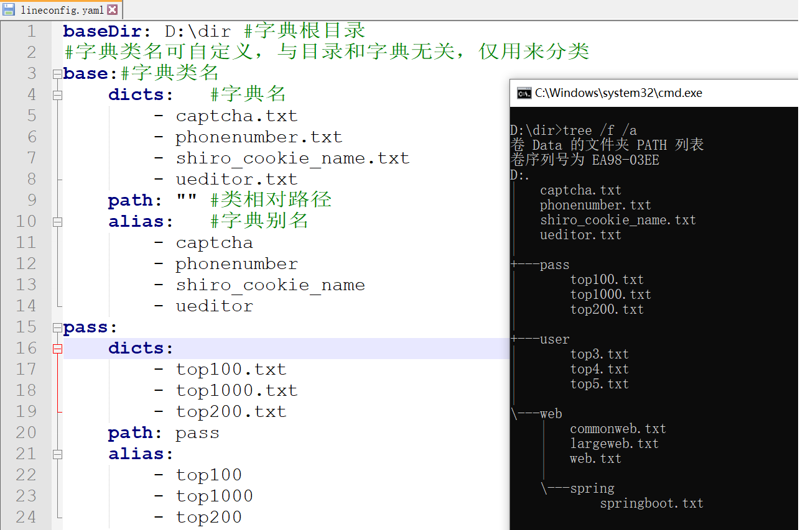
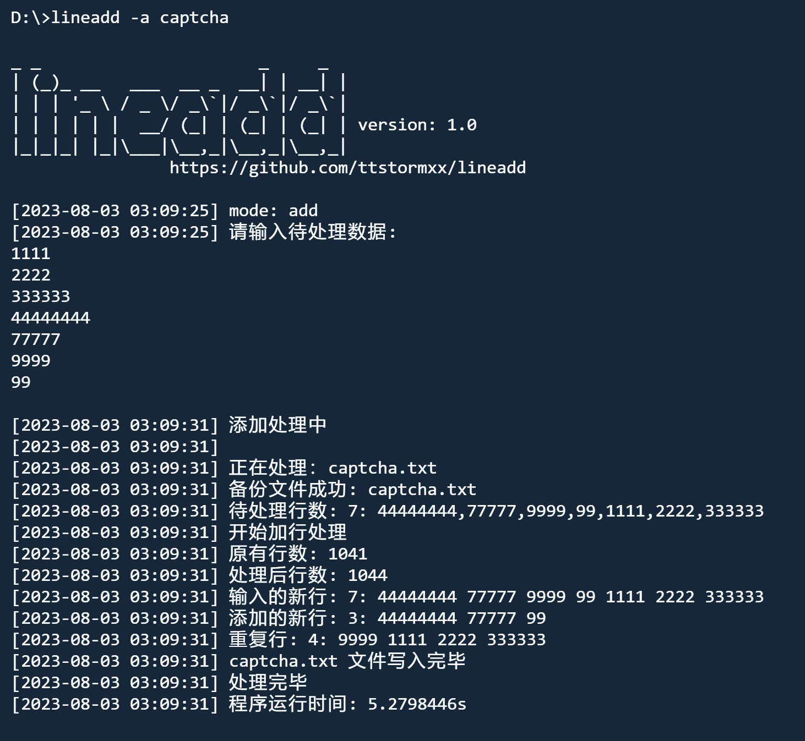

# lineadd
[中文_README](README.md)
## Introduction
In penetration testing, dictionaries are the essence, and dictionary maintenance is a tedious yet crucial task. lineadd provides a simple and effective solution for dictionary management. Life is short, use lineadd to make dictionary management life a little bit easier.

## Ability
Classification, addition, deletion, statistics, viewing, query, backup, and the activities involved in the dictionary maintenance process are all supported.

## Compile
ENV: go 1.20+

Download the binaries in the release

or compile it yourself
```
go mod init lineadd.go
go mod tidy
go build lineadd.go
```
## Help
```
-a      add Add row mode
-d      delete Remove row mode
-c      count Statistics all dictionaries row number and size
-r      read Read the specified dictionary
-b      backup backup all dictionaries
-t      status Dictionary Status and Profile Status
-s      single specify a single dictionary
-f      file file containing data to be processed
-l      line Lines to process from command line input (comma separated)
-q      query Query whether a row is in the dictionary, return the dictionary name and row number
-config Reinitialize (traverse dictionary root directory initialization configuration file)
-base   Dictionary root directory (used to set BaseDir when -config)
-write  Initialize the dictionary root directory according to the configuration file (used when -config)
-silent quiet mode literaly no use
```
## Quick start
#### initialization
The root directory of the dictionary needs to be entered for the first run, and the program automatically traverses the directory to initialize the configuration file





#### Edit configuration file lineadd.yml
The configuration file can be customized, even if all the dictionary text files are in the same directory, they can be freely categorized.


#### Add new lines to all dictionaries under a specific category.
`echo 123123123|lineadd -a web`


#### View the status and aliases of the dictionary.
`lineadd -t`


## trick
#### Data Input Modes
Supports four modes of data input: file reading, command line input, pipe input, and standard input.


If file reading, command line input, and pipe input are not available, enable standard input.



#### Customize dictionary categorization.
The dictionary categorization structure in the configuration file will take effect as long as it satisfies the following structure.
```
captcha: #category
    dicts: #Dictionary Name: List
        - captcha.txt
    path: #Relative Path
    alias: #Alias: List Corresponding to Dictionary Names in Order
        - cap
```

#### Automatically set the configuration file using the root directory.

After adjusting the file categorization under the dictionary root directory, you can reinitialize the configuration file by using the -config option, except for the initial run.

`lineadd -config -base D:\dir`


#### Create Dictionary Root Directory and Dictionaries Based on Configuration File
You can also generate the corresponding dictionary paths and dictionary files based on a carefully configured configuration file, creating a fresh space.

`lineadd -config -write`


## Additional examples
#### query mode
`lineadd  -q -l 123456`


#### Single File Addition/Deletion
```
By using the -s option to specify a single file, you can locate the dictionary based on the dictionary name, alias, or index for file addition or deletion.

#Specify Dictionary Name Explicitly
echo 123456|lineadd -d web  -s web.txt

#Locate Dictionary name using the alias (alias name)
echo 123456|lineadd -d web  -s web

#Locate the dictionary name using the index (index number).
echo 123456|lineadd -d web  -s 3
```


